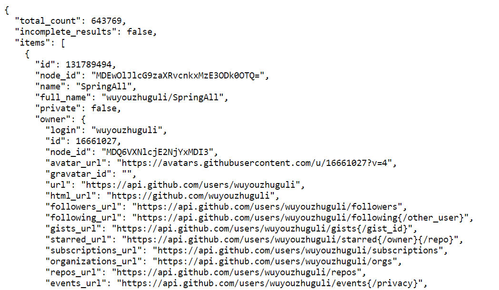
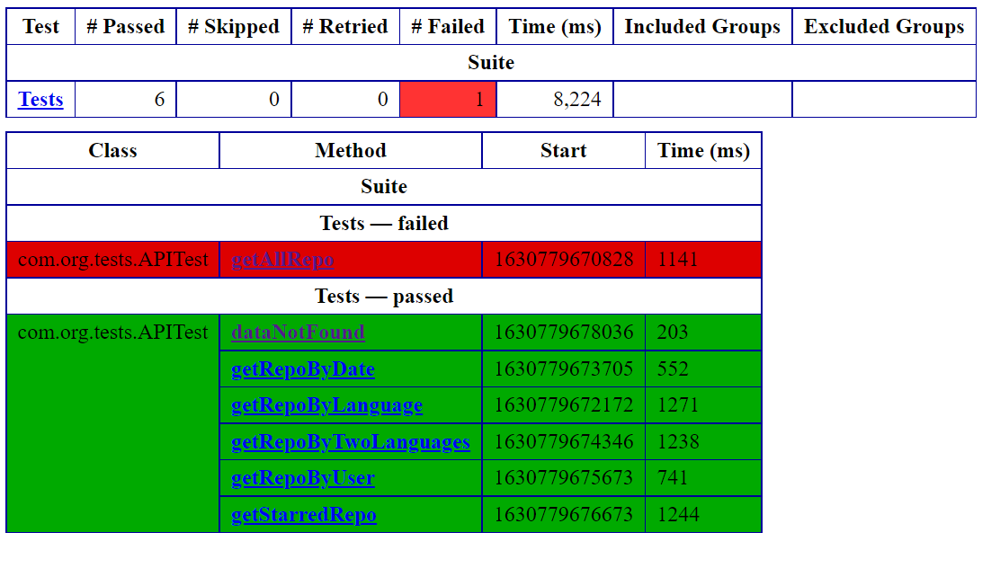

# search-repositories-automation
Api automation for GitHub search repositories

# GitHub API
#Summary -

GitHUb search api helps to search the specific item on the basis of queries, queries are
based on the keywords.
A query contains a combination of keywords and qualifiers.
Based on those queries results can be filtered and sorted as well.

Format - SEARCH_KEYWORD_1 SEARCH_KEYWORD_N QUALIFIER_1 QUALIFIER_N

Search Results will be like below -

#GitHub API automation -

The task was to design and implement an automated testing strategy to verify the functionality and 
behavior of the GitHub API end point -
https://api.github.com/search/repositories?

#Test Automation scenarios covered -

Test automation scenarios are created based on the below queries to fetch, filter and sort
the data from GitHub, also covered the scenario where no data is available and have a specific
error code

Scenario 1

#Note - This may give a different response in terms of total number of repositories and te test case might fail
Search all the repositories from GitHub api and verify the correct api response
https://api.github.com/search/repositories?q=all

Scenario 2
Search repositories by programming language from GitHub api and sort them by stars and verify 
the correct api response
https://api.github.com/search/repositories?q=language:java&sort=stars&order=desc

Scenario 3
Search all the repositories created at a specific date from GitHub api and verify the correct 
api response
https://api.github.com/search/repositories?q=created_at:2018-12-02

Scenario 4
Search all the repositories with two different programming languages and verify the correct 
api response
https://api.github.com/search/repositories?q=language:java+language:python

Scenario 5
Search all the repositories for a specific user from GitHub api and verify the correct api 
response
https://api.github.com/search/repositories?q=user:defunkt&language:java

Scenario 6
Search result for most starred user and sort them by stars high to low
https://api.github.com/search/repositories?q=SpringAll&sort=stars&order=desc

Scenario 7
Verify the error in GitHub api response in case of incorrect query/request
https://api.github.com/search/repositories?q=language:vfdfdgd

#Framework used to automate GitHub API -

HTTP Client , TestNG 

Assertions have been used to verify the response code and the response data from JSON
TestNG annotations are used to write the test cases
testng.xml is used to run the suite and the html report will be available in test-output 
folder

#Language used to write the code -

Java

#pom.xml 
#Dependencies -

RestAPITest
httpclient
httpcore
json
testng

#Framework structure - 

RestClient – To create a connection with the server and specify the API end point
Config.properties – Contains all the queries for different scenarios
TestMain – Read the values from config.properties file
TestUtil – Utility to read JSON response
APITest – Contains all the test cases to be executed
Testng.xml – To execute the complete test suite

#Running automation -

When testng.xml runs the test suite - all test scenarios will be executed based on the
defined priorities
Status code and data returned from the API response will be validated.

#Test Results
Test result will be stored in default report created in html format having details of 
each test scenario with Pass/Fail status

